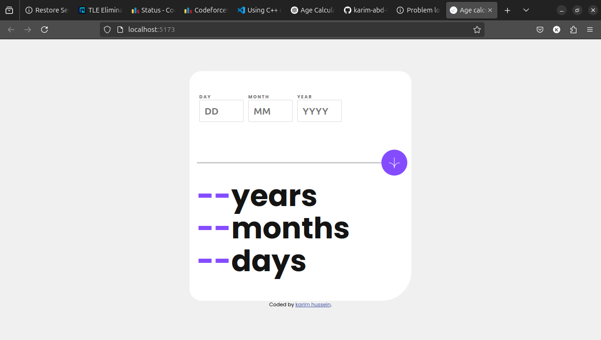
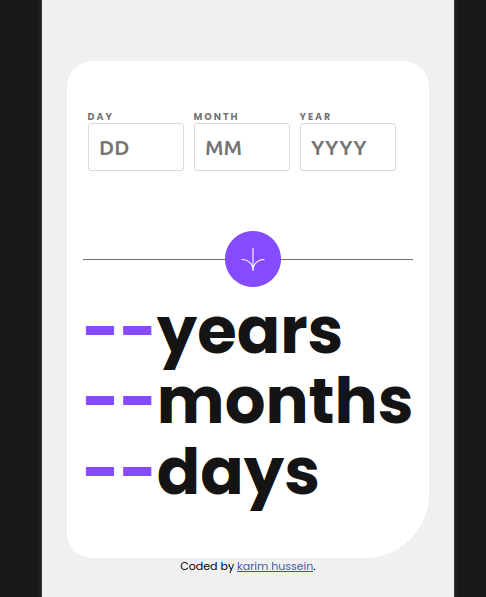

# Age Calculator App

A simple Age Calculator web app built to calculate your age in years, months, and days based on the given date of birth. The app provides validation for incorrect or empty input.

## Features

- Calculate your age in years, months, and days
- Form validation with real-time error messages
- Responsive design for mobile and desktop
- Animation for age results upon submission

## Screenshot

## Live Demo

You can try the live version of the app here: [Live Demo URL](https://age-calculator-sand-ten.vercel.app/)

## Built With

    - React
    - Vite
    - Font Awesome
